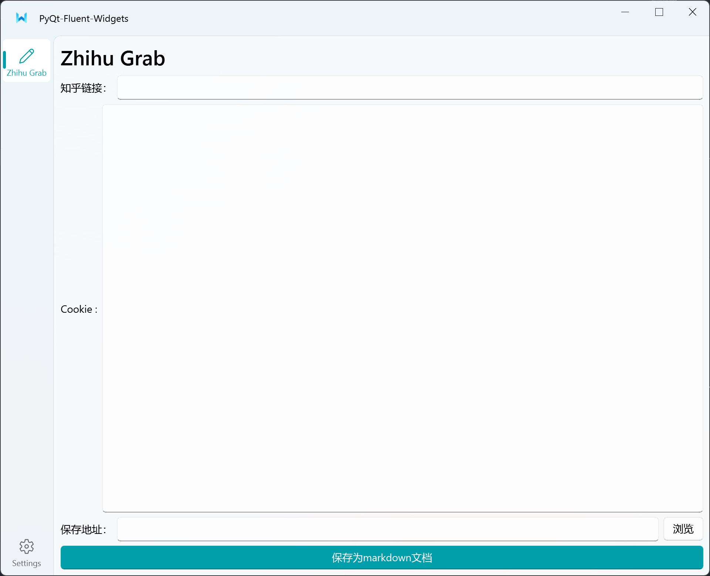

# Zhihu Grab

基于 [QFluentWidgets](https://github.com/zhiyiYo/PyQt-Fluent-Widgets) 开发的知乎文章抓取工具，支持将知乎文章转换为Markdown格式。

## 功能特点

- 现代化的 Fluent Design 界面风格
- 支持输入知乎文章链接自动抓取
- 支持自定义Cookie以获取完整文章内容
- 支持选择保存位置
- 自动下载文章中的图片和视频
- 转换为Markdown格式便于保存和分享
- 支持深色/浅色主题切换

## 环境要求

- Python 3.7+
- PyQt5
- QFluentWidgets
- BeautifulSoup4
- Requests
- ...

## 安装

1. 克隆项目到本地：
```bash
git clone https://github.com/yourusername/zhihu-grab.git
cd zhihu-grab
```

2. 安装依赖：
```bash
pip install -r requirements.txt
```

## 使用方法

1. 运行程序：
```bash
python main.py
```

2. 在程序界面中：
   - 输入知乎文章链接
   - 填入知乎Cookie（可选，但建议填写以获取完整内容）
   - 选择保存位置
   - 点击"保存为markdown文档"按钮

## 项目结构
```
root
│  deploy.py                (Nuitka 部署脚本)
│  main.pro                 (Qt 项目文件)
│  main.py                  (程序入口)
│  requirements.txt         (依赖文件)
│  zhihugrab.ui            (UI 设计文件)
│
├─app
│  ├─common                 (公共模块)
│  │      config.py        (配置文件)
│  │      icon.py          (自定义 Fluent 图标)
│  │      resource.py      (资源文件)
│  │      setting.py       (常量定义)
│  │      signal_bus.py    (信号总线)
│  │      style_sheet.py   (自定义样式表)
│  │
│  ├─resource              (资源文件夹)
│  │  │  resource.qrc      (Qt 资源文件)
│  │  ├─i18n              (国际化文件)
│  │  ├─images            (图片资源)
│  │  └─qss              (样式表)
│  │
│  └─view                  (界面文件)
│         main_window.py   (主窗口)
│         setting_interface.py (设置界面)
│         zhihugrab_ui.py  (主界面)
│
└─src                      (核心功能实现)
    transform.py           (转换核心逻辑)
    util.py               (工具函数)

```

## 打包发布

本项目使用 Nuitka 进行打包，可以生成独立的可执行文件。确保你已经安装了 Nuitka：

```bash
pip install nuitka
```

在Windows系统上，还需要安装：
- Visual Studio Build Tools（MSVC）
- Visual C++ Runtime

然后执行打包命令：
```bash
python deploy.py
```

打包配置说明：
- 使用 standalone 模式生成独立执行文件
- 自动包含 PyQt5 相关插件
- 包含必要的 Qt 样式和主题
- 输出目录为 `build/main.dist`

打包完成后，可在 `build/main.dist` 目录下找到可执行文件。

## 贡献

欢迎提交 Issue 和 Pull Request。

## 致谢

- [QFluentWidgets](https://github.com/zhiyiYo/PyQt-Fluent-Widgets) - 现代化的 PyQt Widgets 库
- [PyQt5](https://www.riverbankcomputing.com/software/pyqt/) - Python Qt 框架
- [BeautifulSoup4](https://www.crummy.com/software/BeautifulSoup/) - HTML 解析库